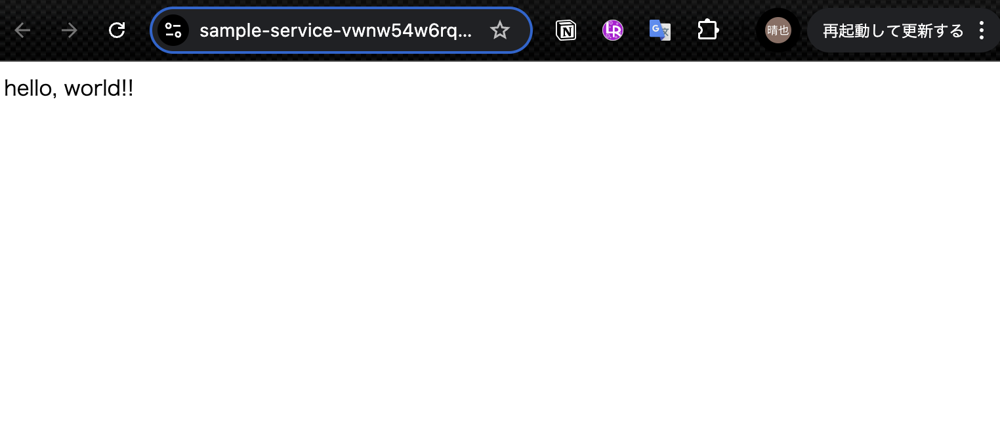
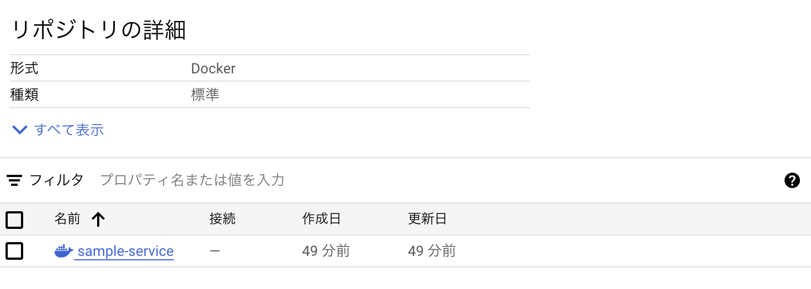

# cloud Runへソースコードからデプロイ

---

## チュートリアル
https://cloud.google.com/run/docs/deploying-source-code?hl=ja

### flaskのHTTPサーバーを実装する
```python
from flask import Flask

print('hello, world')
app = Flask(__name__)

@app.route('/')
def hello():
    return "hello, world!!"

if __name__ == '__main__':
    app.run(host='0.0.0.0', port=8080)
```

uv でflaskをaddして、pip freezeによりrequirements.txtを生成する
```txt
blinker==1.9.0
click==8.1.7
flask==2.3.2
itsdangerous==2.2.0
jinja2==3.1.4
markupsafe==3.0.2
werkzeug==3.1.3
```

ここまでやったらローカルでwebサーバが立ち上がることを確認する
http://localhost:8080

### Dockerfile
dockerfileを作成しなくてもデプロイできるが、今回はdockerfileを作成し、自動的にartifact registoryに保存する方法でデプロイする

> ソースデプロイでは、Artifact Registry を使用してビルドされたコンテナが保存されます。プロジェクトで、デプロイ先のリージョンに cloud-run-source-deploy という名前の Artifact Registry リポジトリがまだない場合、この機能により、cloud-run-source-deploy という名前の Artifact Registry リポジトリが自動的に作成されます。

```Dockerfile
FROM python:3.9-slim

WORKDIR /app

COPY requirements.txt /app/requirements.txt
COPY hello.py /app/hello.py

RUN pip install --no-cache-dir -r requirements.txt

EXPOSE 8080

CMD [ "python3", "hello.py" ]
```

### API有効化
```sh
gcloud services enable run.googleapis.com
```

### 権限確認
- Cloud Run ソース デベロッパー（roles/run.sourceDeveloper）
- サービス アカウント ユーザー（roles/iam.serviceAccountUser）

これらのロールが実行するアカウントユーザーに付与されているか確認する

### デプロイ
```sh
gcloud run deploy $SERVICE_NAME \
    --source $SOURCE_DIR \
    --region $REGION \
    --project $PROJECT_ID \
    --allow-unauthenticated
```

### 確認
以下が表示されれば成功
```
Service [sample-service] revision [sample-service-00001-txh] has been deployed and is serving 100 percent of traffic.
Service URL: https://sample-service-vwnw54w6rq-an.a.run.app
```



artifact registoryのcloud-run-source-deployというリポジトリに指定したサービス名でイメージが作成されている


